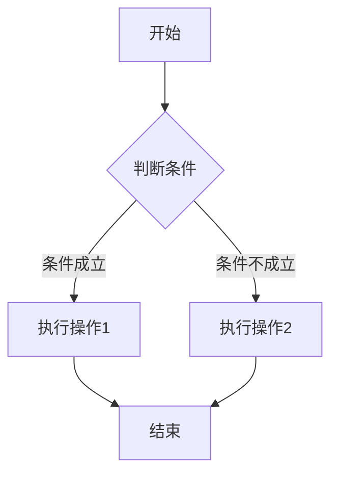
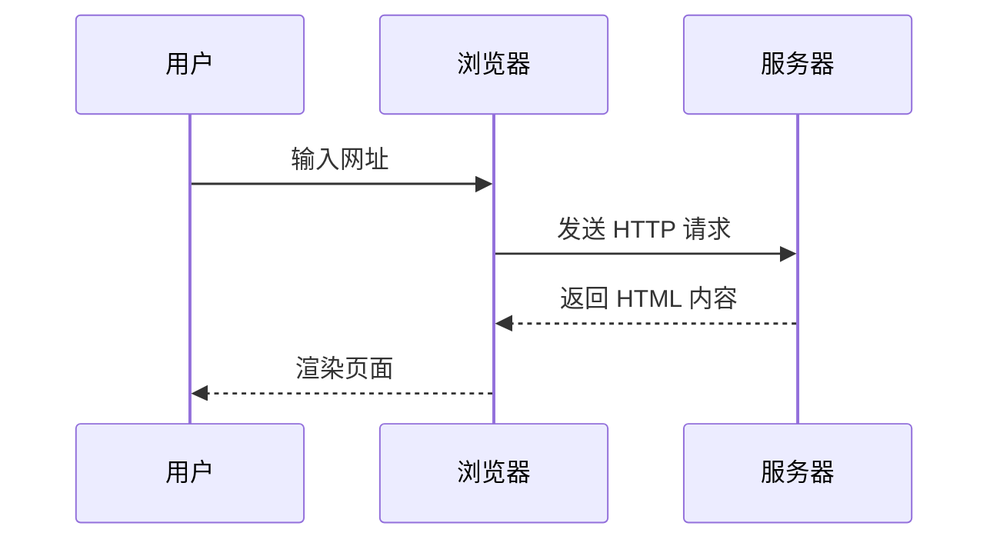
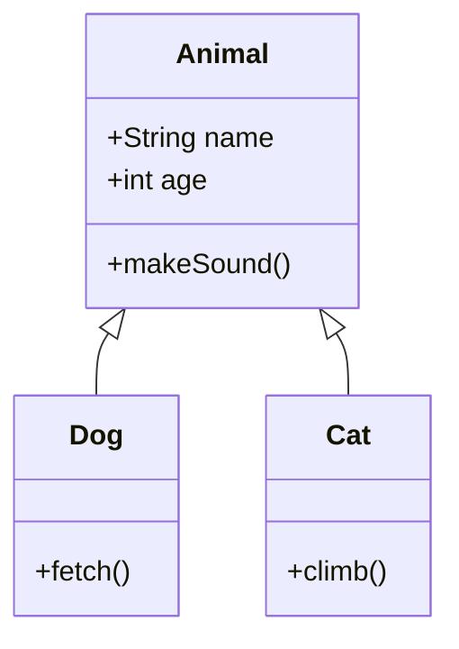
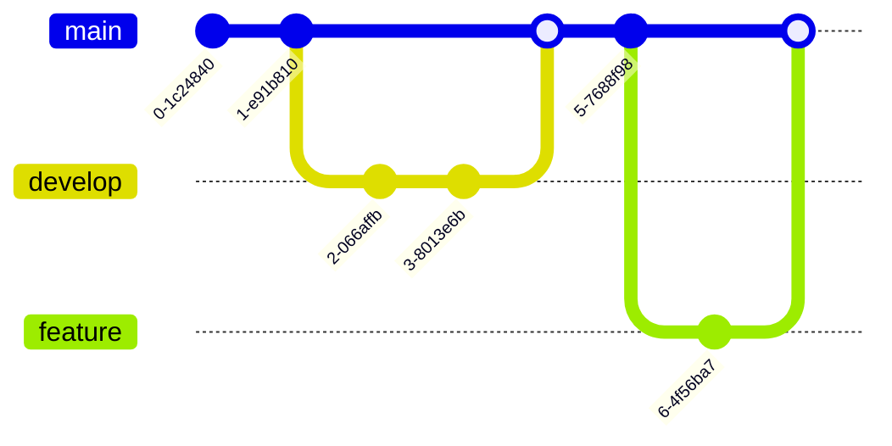
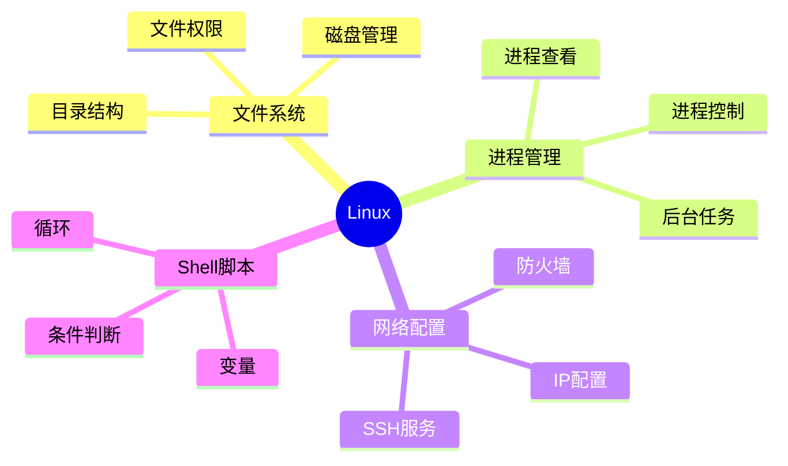
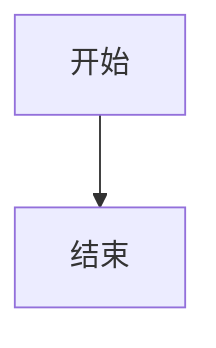

# Mermaid 图表使用指南

你的 VitePress 博客现在已经支持 Mermaid 图表了！以下是各种图表的使用示例。

## 流程图 (Flowchart)



## 时序图 (Sequence Diagram)



## 类图 (Class Diagram)



## Git 分支图 (Git Graph)



## 思维导图 (Mindmap)



## 如何在笔记中使用

在 Markdown 文件中，使用代码块并标注 `mermaid` 即可：

````markdown

````

常用图表类型：
- `flowchart` - 流程图
- `sequenceDiagram` - 时序图
- `classDiagram` - 类图
- `stateDiagram` - 状态图
- `erDiagram` - ER 图（实体关系图）
- `gitGraph` - Git 分支图
- `mindmap` - 思维导图
- `gantt` - 甘特图
- `pie` - 饼图

更多语法参考：[Mermaid 官方文档](https://mermaid.js.org/intro/)
