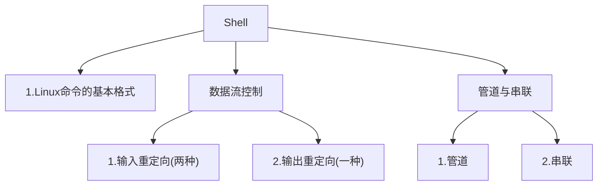
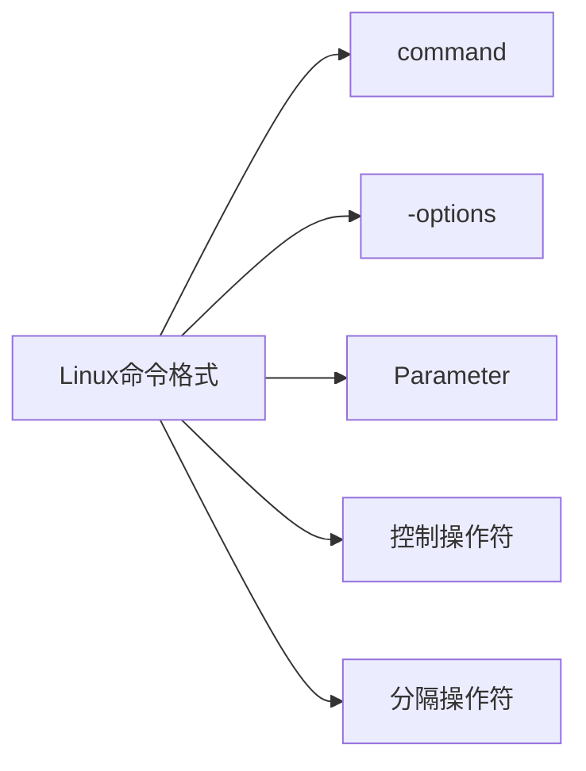
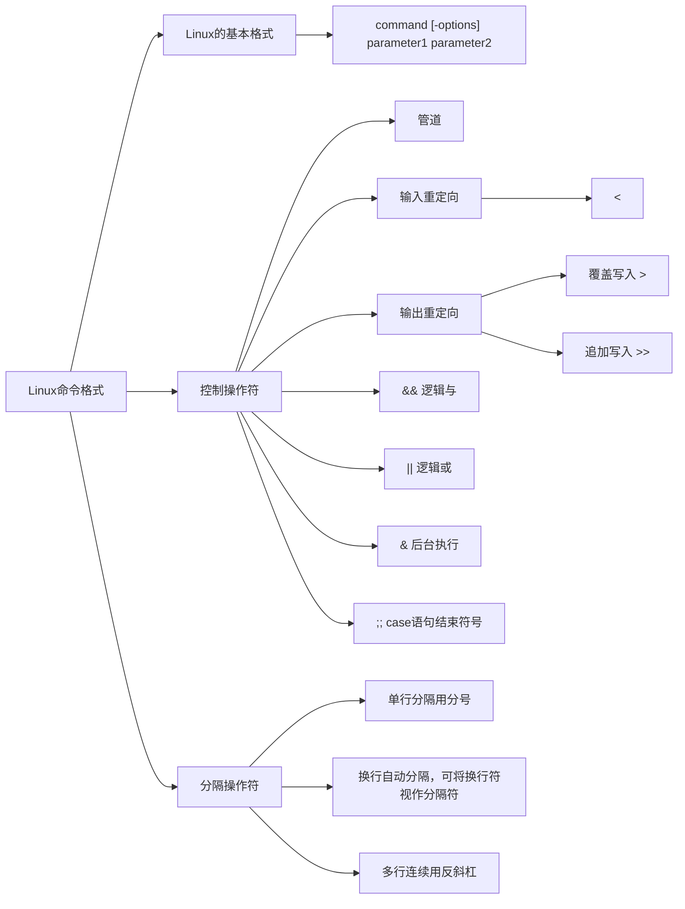

# Shell

要想掌握shell，我想我们得先从一切的起点开始——Linux的命令格式与规则

本文的基本结构如下:



Linux命令的格式(也可以说是语法)，结构如下

其中 command -options Parameter 为输入命令的基本结构，控制操作符就是控制数据相关的内容，有两种，一种是控制数据的流向，一种是控制数据的运行逻辑。分隔操作符就是shell语法的标点符号，本身不产生任何动作或数据流向。
最开始不必先全部搞明白，该图仅用于先了解基本结构，后续我们会逐步讲解，讲解后可以再回来看应该就会很舒服了

## Linux命令的基本格式

```shell
command [-options] parameter1 parameter2 
```
其中`command`是指令，`[-options]`是选项，`parameter1 parameter2`是参数

其实这个结构没有那么吓人，就像你对一个人说话，你要告诉他**去**，**怎么去**,**去哪里**，而`command`就是去。`[-options]`就是怎么去，`parameter`就是去哪里或者说是对象

小结如下:
- `command`是你输入的指令
- `[-options]`是选项，也就是修饰词
    >但是要注意,两个方括号在你实际写的时候不要加不要加不要加，这里只是用于区分开
- `[parameter]`是参数，是作用对象
>我们必须强调，options与parameter是可选的，也就是说，你完全可以不写options，部分情况下可以不写parameter，因为有些指令是默认包含参数的，就像你大早上有个早八，你和你舍友说：“走。”我想你们应该都知道去哪里，早八的教室就是默认的参数，而你说的走，就默认包含了这个参数。于是就不用写parameter了。

接下来我们就掌握了其基本格式，于是我们该说两个别的东西了，一个是控制操作符，一个是分隔操作符，控制操作符就是控制程序的数据的流向，分隔操作符是控制程序的执行逻辑（顺序等）。我们即将说的输入与输出重定向就是控制操作符，管道与串联就是分隔操作符。你不必现在就一定要明白，可以先往下看

---

## 数据流控制：输入与输出

经过上面的讲述，我想你已经明白了Linux的基本规则，接下来我们说一下Shell最强大的特性之一，就是其对数据流的控制，也就是数据流向哪里，从哪里开始流，也就是输入与输出的重定向

首先我们先说输入的重定向

一看到这个词好像就很高端，但是其实这个无非就是我们要把输出给到哪里而已。
因为默认就是直接显示在屏幕上，你可以直接输入一个`echo "哈哈哈"`试试。但是有些时候我们上一步的结果需要提供给下一步使用，这时候我们就需要把它重定向到一个文件中去，这样**下一个命令或者文件**等就可以从这个文件中读取数据了，这样子就会很方便管理。

理解完这个概念之后，我们来说他的基本结构

Shell的输出重定向有两个符号

- `>`这个符号是指覆盖写入，也就是替换
- `>>`这个符号是追加写入，也就是额外再加入。

接下来我将给你展示示例，但我想再看示例前，我必须得强调一个点，就是先不要试图看明白每个代码在干什么，而是先看他的结构，是如何符合我们之前讲的结构的。

```shell
date > file #这个代码的意思就是把file这个文件的内容替换成date这个命令的输出结果
: <<'EOF'
我不知道你有没有发现，这个就是我们上述所说的，他没有对象。
但是理论上来讲，如果没有告知作用对象是不可能有用的，但是这个命令有默认的操作对象，于是就不会出现问题了
这个代码的结构是："command 输出重定向结构" ; 输出重定向与后面我们即将说的分隔符是Linux的另一部分的格式。我们下文会阐述。
EOF
```

讲完输出重定向，接下来我们来说说输入重定向

既然输出重定向来自于我们的命令的输出结果给到哪里，这是一个问题。那么我们的命令来自于哪里呢，也就是输入的重定向，有了输出的重定向不能没有输入的重定向吧。我们想一想就可以发现，命令的输入数据是不是默认就来自于键盘，键盘不去输入，计算机就不会自己去找一个什么数据出来。所以输入重定向就可以理解为把键盘换掉，既然我们不用键盘输入数据了，那就是电脑内部的文件进行输入，那这样我们就可以从某个文件中读取数据并且进行某些操作。

接下来我们将讲述他的基本结构

shell的输入重定向只有一个符号`<`。其用法于上文输出重定向自然也是类似的

示例如下

```shell
# 从 file1 读取数据排序，结果存入 file2
sort < file1 > file2
```

---

## 串联与管道

我们接下来先说串联是个什么东西，简而言之就是前面输出不影响后面输入。你完全可以把这个可以当做废话，因为平常不管你写python也好还是C语言也好，除非你刻意写的结构或者你忘了加分隔符，不然前`command`怎么会影响到下一个`command`呢
> 还是早八，你起床后告诉舍友：“走”和你舍友中午说“吃饭”，这两个如果你不刻意做，他是互不影响的。当然如果你要说我上早八累死了得多吃点，那就是一种“去上早八”这个命令的输出影响到了你“中午吃啥”的输入
所以串联其实就是一个没用的名字，其本质就是说明这个指令已经结束了，开始执行下一个指令。
> 嗯就像“去上早八”指令的结束是到了教室或者怎么着，这个就是分隔符，意思就是去上早八这个指令结束了，该执行下一个指令“思考吃什么了”。
再说一个编程语言里面的例子，在python里面，换行就是分隔符，C语言里面`;`是分隔符。我们将用C语言来说明，你不需要看懂这行代码，当然能看懂也好
> 因为C语言是需要你手动打出来换行符的，这和我们目前讲的串联的形式差不多，所以我们就用C语言来说明一下串联的概念，但是切记不用理解，如果你想要理解我也在代码上写有注释，只是借用一下基本结构，就类似套公式，理不理解里面的数字是另一回事了就。

补充：**int的基本格式**就是`int 变量名`或者`int 变量名 = 值` ，其中`int`就是一个`command`

```C
int main(){
    int a = 10;//int是声明一个整数类型的变量，告诉计算机，这个变量是个整数，我要用，你快给我在内存腾个对应的位置出来。
    int b = 20;
    return 0;
}
```

```c
int main(){
    int a = 10//这个没有加分隔符是错误案例哦
    int b = 20;
    return 0;
}
```

我们最初在写C语言的时候，如果你不加这个分号，就会报错（其实我刚学的时候也经常忘加）。报错的原因就是在一个初学者看来，他的int命令已经结束了，你下面的`int b = 20`是重新使用了int命令，但是对于C语言不是这样的。对于计算机，第二个示例中就是一个命令，命令的内容是`int a = 10 int b = 20`。然后计算机果断表示：“你这是啥啊小老弟，int这个命令还能这么使用吗，我咋不知道。”但是目前编程语言还不会自动学习，于是他自然而然就给你报个错。

那么讲了这么多，我们来说说shell当中的分隔符。
shell对于分隔符的处理有两种模式：1. 换行就是分隔符 2. 你用分号`;`来分隔同一行的命令
那对于某些实在是必须得跨行的，那就使用`\`（其实基本都是为了美观，方便看）
> 所以如果你见到一个人写shell出现了句末换行符，然后又换了一行，请不要想什么，他大抵是一个写C语言的，因为C语言换行不是分隔符，所以他换行也得加分号，但是对shell有没有影响，当然最好还是不要有这样子的习惯，说不定会有什么问题。

示例如下

```shell
# 每条命令一行，换行即分隔
echo "Hello Shell"
ls -l
cd /tmp
pwd
```

```shell
# 一行多条命令，用 ; 分隔
echo "Start"
ls -a
echo "Done"
cd ~
pwd #＃前的代码和这里完全一样哦   echo "Start"; ls -a; echo "Done"; cd ~; pwd
```

```shell
echo "Start"
ls -a
echo "Done"
cd ~
pwd
```


接下俩我们来说一下管道是什么

我一直觉得管道这个词不是特别好，因为你看到的第一瞬间你很可能会发懵，为什么计算机里能有个管道，但是没错，就是管道。管道有一个特性，就是连续。比如我们现在有一个10cm的水管，你从某一段注入水，距离你6cm处的水是不是就来自于4cm处的水。也就是说，4cm处给出的水，就是6cm处接收的水，也就是管道的核心思想。某个指令的输出作为下一个指令的输入

接下来依旧是他的基本结构`|`。但是这个结构很简单，就一个符号，很明显我们大概率是完全看不懂的，前面需要加什么，后面又可以加什么呢，所以接下来我将给你举一些例子

```shell
cat file1 file2 file3 | sort > /dev/lp #cat是`command`,查看文件内容，sort是排序，/dev/lp是打印机
#运行逻辑就是，先查看这三个文件，然后`对这三个文件(cat file1 file2 file2的输出)`进行排序，排序的结果打印出来
```

那么管道就是前面输出影响后面输入。

最后，我们额外补充一些规则

## 逻辑与，或

“逻辑与，或”是控制操作符的一种，“逻辑与”就是前面指令执行成功才会执行后面的指令，“逻辑或”就是前面指令执行失败才会执行后面的指令。

“逻辑与”就比如你要请假(command1)，旅游(command2)，请假成功了，才会执行后面的旅游指令，请假失败了，就不会执行旅游指令。
“逻辑或”就比如你要请假(command1)，上课(command2)，请假成功了，就不去上课了，请假失败了，才会去上课（其实就是满足其一即可，但是计算机想着说，我第一个满足了，我是不是就没必要进行第二个了，所以“逻辑或”才是前面指令执行失败后执行后面的指令）

基本结构如下
- 逻辑与`&&`
- 逻辑或`||`

事实上Linux还有两个操作符`&`与`;;`
- `&`的意思就是放入后台执行。在基本结构最后的位置额外加一个"&"即可，其实无非就是你不关心他的进行过程，你还有别的事情要干，就把他放到后台去执行。
- `;;` 的意思是case语句结束符号。我们会在后续再讲，避免文章过于冗长

## Linux的一些规则

- 大小写敏感：在Linux里面A≠a，也就是说，比如cd指令，输入CD就是识别不到
- 空格分隔：指令、选项、参数之间必须用空格隔开，多格空格Shell视为一格。
- 指令太长：使用 \ 跳脱回车键，使指令连续到下一行


到这里，Linux的基本结构你就已经理解了，你可以开始看一些shell代码，不必尝试理解每一个命令的含义，而是先搞明白其结构是怎么样子的，然后对于某些你要高频使用的命令或者结构进行记忆，比如`cd`。着重记忆即可。
事实上，我们操作符符并没有讲完，因为有一些特殊的，比如`[]`是条件测试，`$`是引用变量，`;;`是case语句的结束标志，但是我们会在后面逐步和你讲解，这一篇的主要目的就是在于理解LINUX的语法结构与部分格式。


